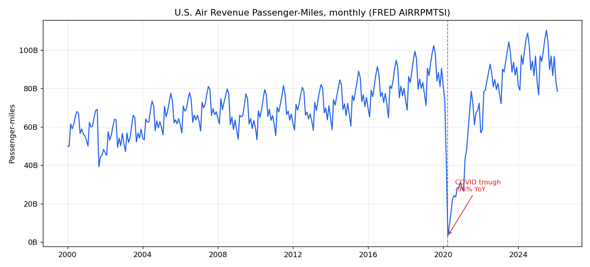
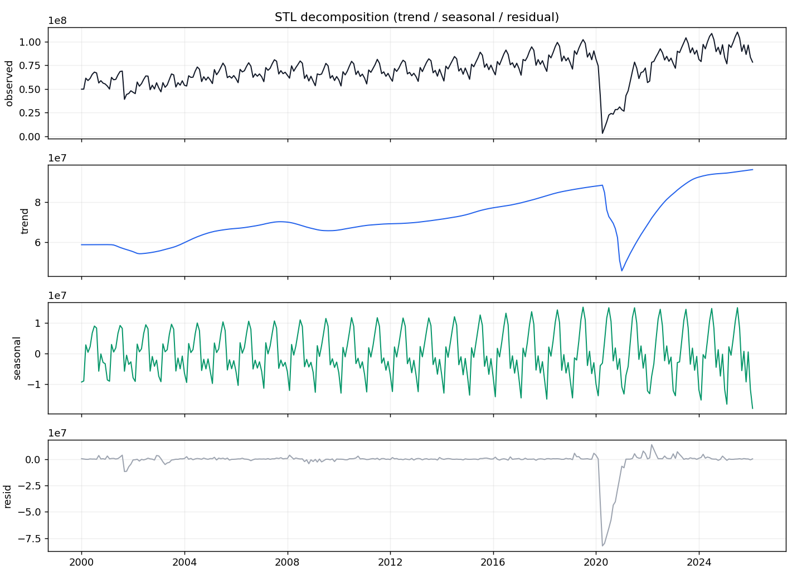
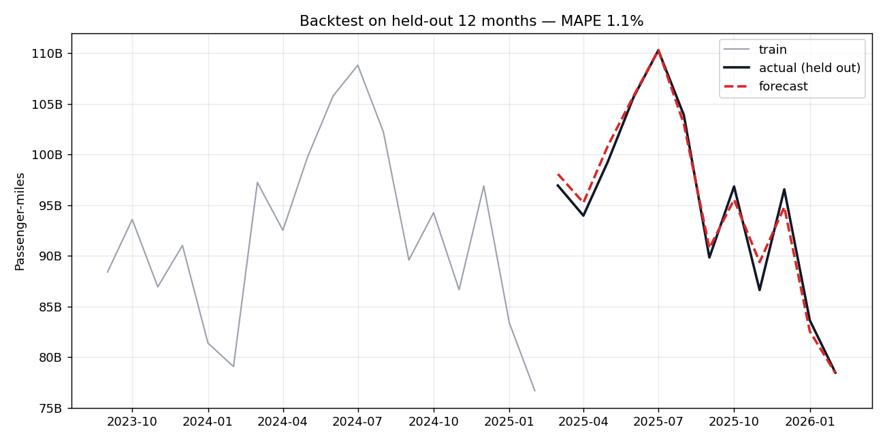
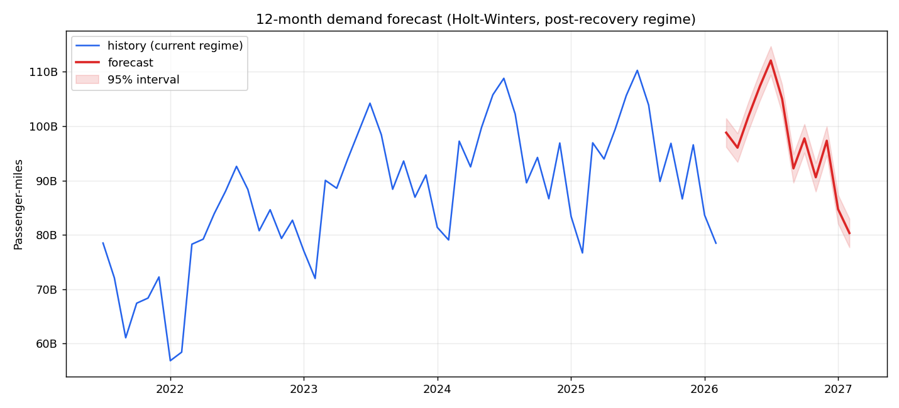

# tourism-demand-forecast

End-to-end seasonal forecasting of U.S. air-travel demand on public monthly
data, with explicit, defensible handling of the COVID structural break.

It ingests a public FRED series, cleans it into a monthly time series, profiles
its seasonality and quantifies the pandemic shock, then backtests and runs a
12-month Holt-Winters forecast. The headline result is a **1.15% MAPE** on a
held-out 12-month window.

> The interesting part of this project is not the model. It is the judgment
> call about *what data to fit it on* when the history contains a 96% demand
> collapse. Full reasoning in [`reports/NARRATIVE.md`](reports/NARRATIVE.md).

---

## Results

**Series:** U.S. Air Revenue Passenger-Miles, monthly, Jan 2000 – Feb 2026 (FRED `AIRRPMTSI`, 314 obs).

| | |
|---|---|
| Seasonality | Peaks **July**, troughs **February**, ~**1.43×** peak-to-trough |
| COVID shock | **−96.4%** YoY at the April 2020 trough; recovered to 2019 average by **July 2022** |
| Backtest (held-out 12 mo) | **MAPE 1.15%** |
| Model | Holt-Winters (additive trend, multiplicative seasonality), fit on the post-recovery regime |

### Full history — and the shock the model is built to survive


### Seasonal decomposition (STL)


### Backtest on held-out 12 months


### 12-month forward forecast


---

## Approach

```
ingest  →  clean  →  analyze  →  forecast  →  figures
 FRED      monthly   seasonality   Holt-Winters   reports/
 snapshot  series    + COVID break  + backtest
```

1. **Ingest** (`ingest.py`) — pull the FRED series; a committed snapshot makes the pipeline reproduce offline.
2. **Clean** (`clean.py`) — parse to a contiguous month-start series, coerce types, interpolate any internal gaps.
3. **Analyze** (`analyze.py`) — STL decomposition, a seasonal index computed on the post-recovery window, and a quantified COVID-impact summary.
4. **Forecast** (`forecast.py`) — fit on the post-recovery regime, backtest on a held-out tail (MAPE/RMSE/MAE), then project 12 months with empirical prediction intervals derived from the backtest residuals.
5. **Pipeline** (`pipeline.py`) — orchestrates all of the above, writes every figure to `reports/figures/` and the headline numbers to `reports/metrics.json`.

Why fit only on the recovered regime, and what the forecast does and does not
claim, is argued in [`reports/NARRATIVE.md`](reports/NARRATIVE.md).

## Run it

```bash
git clone https://github.com/MarcAlbert06800/tourism-demand-forecast.git
cd tourism-demand-forecast
python3 -m venv .venv && source .venv/bin/activate
pip install -e ".[dev]"

python -m tourism_forecast.pipeline   # regenerates figures + metrics.json
pytest -q                             # 5 tests, runs on the committed snapshot
```

## Data

Public-domain U.S. federal data. Provenance in [`data/README.md`](data/README.md).

## License

MIT © 2026 Marc Albert
